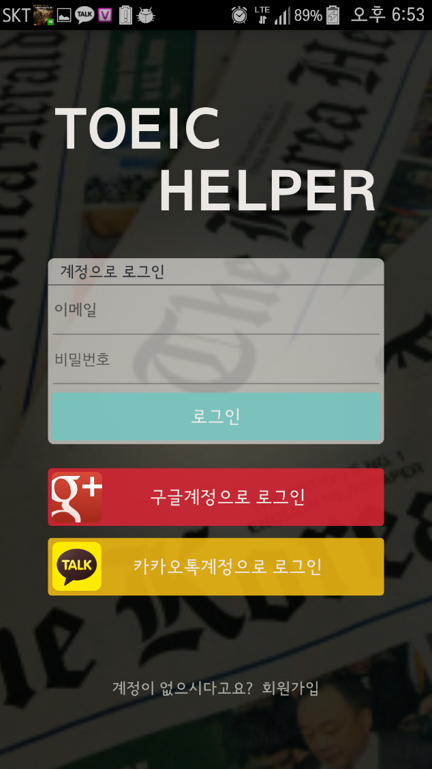
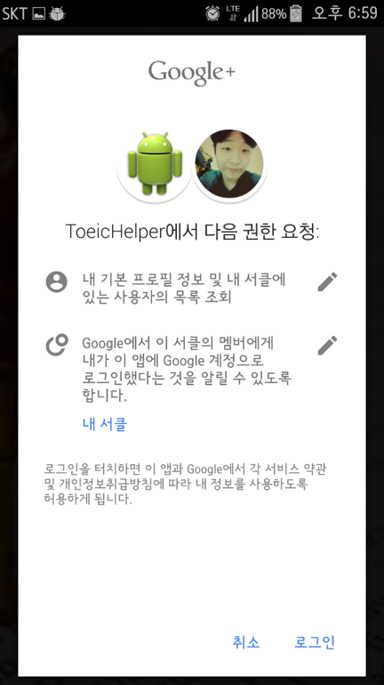
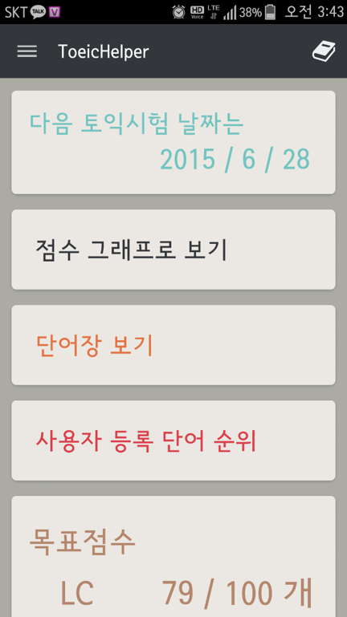
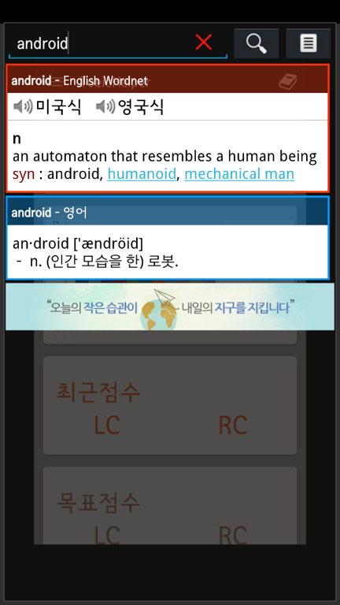
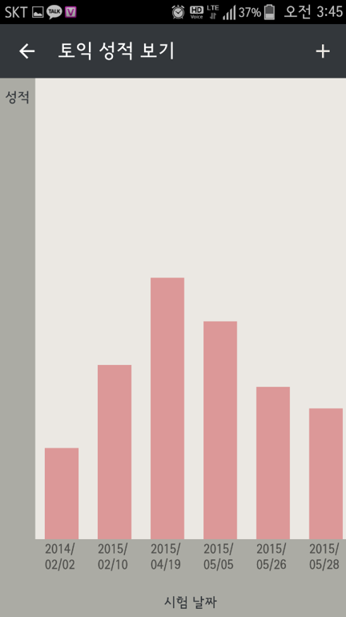
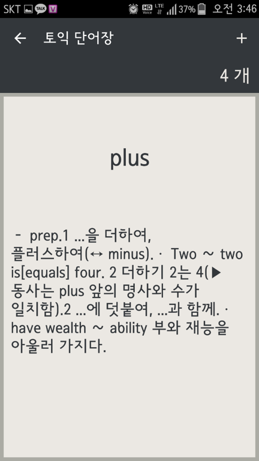
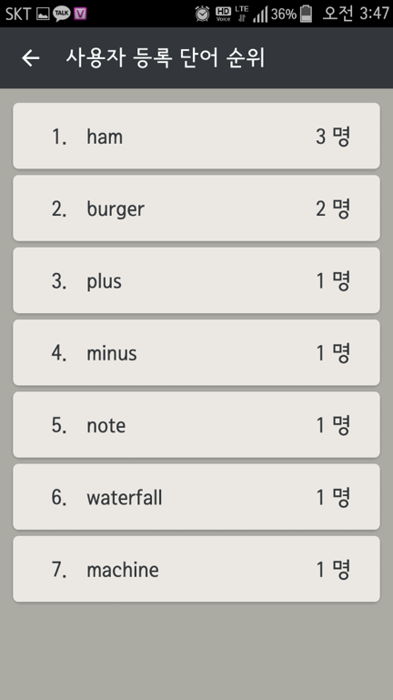

# ToeicHelper

### 수강과목 : 산학협력1(4학년 1학기)

### 프로젝트 개요 :  
TOEIC 시험 점수 향상과 관리에 편리함을 주기 위해 Android App으로 구현하였습니다.

### 기간 : 2015.03 ~ 2015.06

### 주요 기능 :
- 개인 정보 저장과 관리를 위한 **회원제** 시스템
- **[ColorDict][2]** 앱을 연동하여 개인 단어장 생성 및 관리
- TOEIC 최신 시험 날짜 확인(ETC 홈페이지 **HTML 파싱**) 및 사용자 스마트폰 **일정으로 등록**
- TOEIC 시험 점수 등록 및 **그래프** 확인
- 사용자 **등록 단어 순위** 확인
- TOEIC 시험 목표 점수 설정
- 사용자 **Google** 계정 email 정보 불러오기

#### **사용 기술** : `Android Java`, `php`, `MySQL`, [닷홈 Server Hosting][1]

#### **사용 툴** : `Android Studio`, `SublimeText2`
  
  
  
  
### SCREEN SHOT
-------

   
  

[1]: https://www.dothome.co.kr/
[2]: https://play.google.com/store/apps/details?id=com.socialnmobile.colordict&hl=ko
